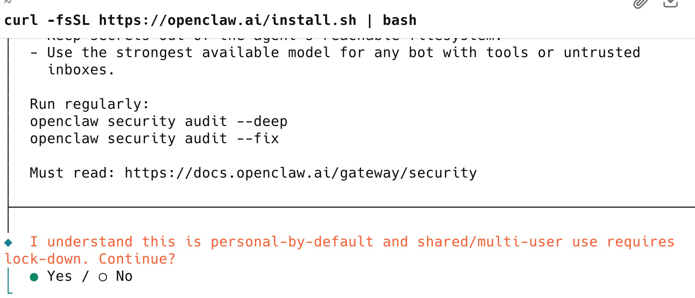
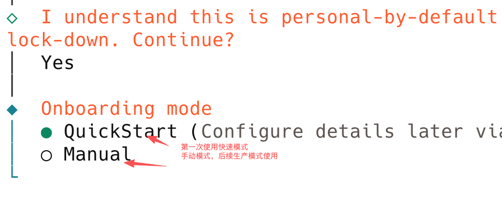

# 重点问题说3次：

全程开启VPN 全程开启VPN 全程开启VPN ,重复运行脚本几次

mac打开终端下面是自动化脚本安装，我打开了vpn，并且运行了大概3次，成功，之前2次都中途失败，但是这个不需要动脑，他会自动确认你的系统并且安装：


```
curl -fsSL https://openclaw.ai/install.sh | bash
```

如果发现安装问题，直接复制给ai，按照提示一步步执行

出现下面问题，代表安装成功，选择yes，继续






# 下面是手动安装

##### 下面的所有功能需要有程序员基础的自行安装

安装方法有GitHub 里面使用git clone 加上源码地址，这个不适合新手，下面推荐给大家使用 更简单的方法：

提前安装node.js

```
brew install node
```

如果发现brew不能用,需要安装Homebrew：

```
/bin/bash -c "$(curl -fsSL https://raw.githubusercontent.com/Homebrew/install/HEAD/install.sh)"
```

验证方法：

```
brew --version
```

手动安装其他，请参看视频里面自动脚本里面的 脚本帮你安装的git  homebrew node.js 这些自己手动安装完以后，可以再自动运行上面的脚本

```
curl -fsSL https://openclaw.ai/install.sh | bash
```

