模型选择

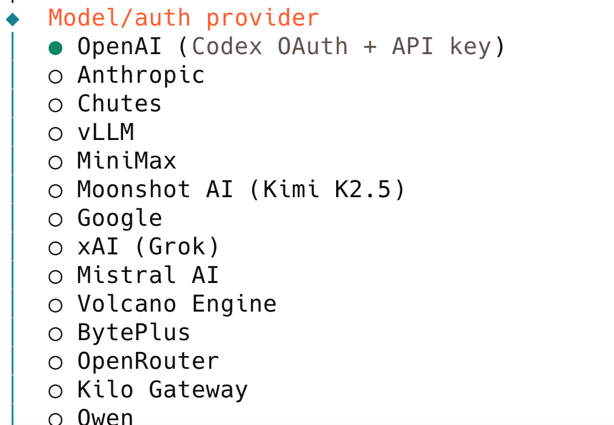

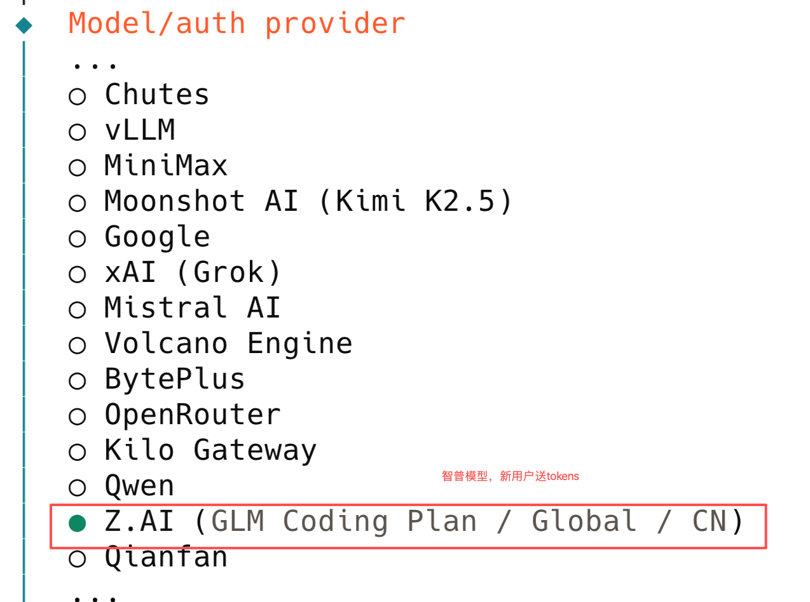

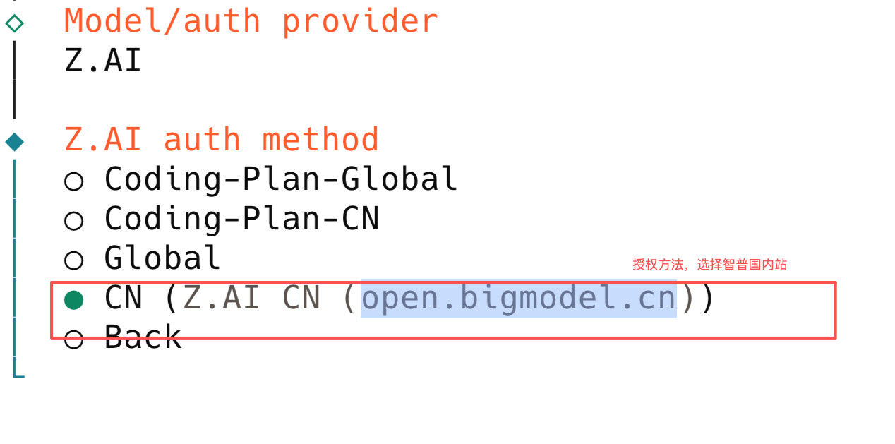


- API key **不绑定模型**
- 一个 key **可以调用所有 GLM 模型**

https://bigmodel.cn/finance-center/resource-package/package-mgmt

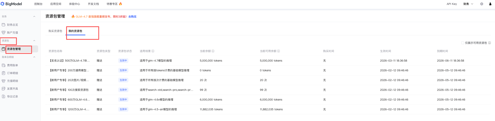

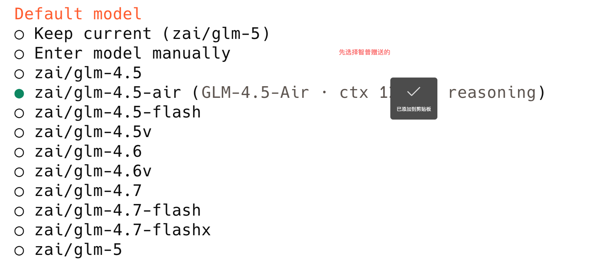


# 配置openclaw

```
openclaw config
```

如果之前配置过，提示配置过：

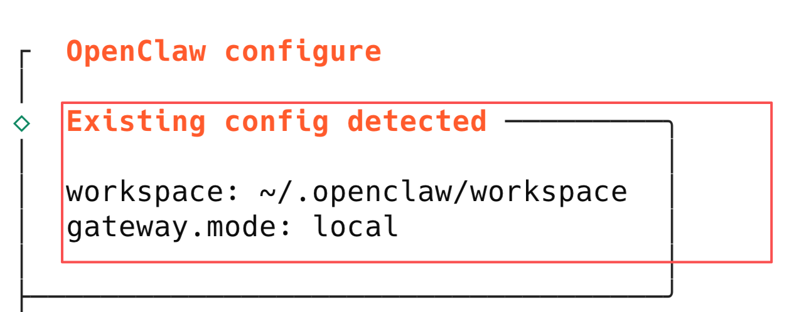

这里会显示配置文件的位置：


减少tokens的限制配置：

默认：很大，手动修改成小的1024


# Mac端的默认openclaw目录： 

```
~/.openclaw/
```

# windows的默认openclaw目录

```
C:\Users\你的用户名\.openclaw\workspace
```

# Windows 进入openclaw目录

## CMD

```
cd %USERPROFILE%\.openclaw
```

## PowerShell：

```
cd $env:USERPROFILE\.openclaw
```

# 如果找不到这些目录执行命令

```
openclaw setup
```

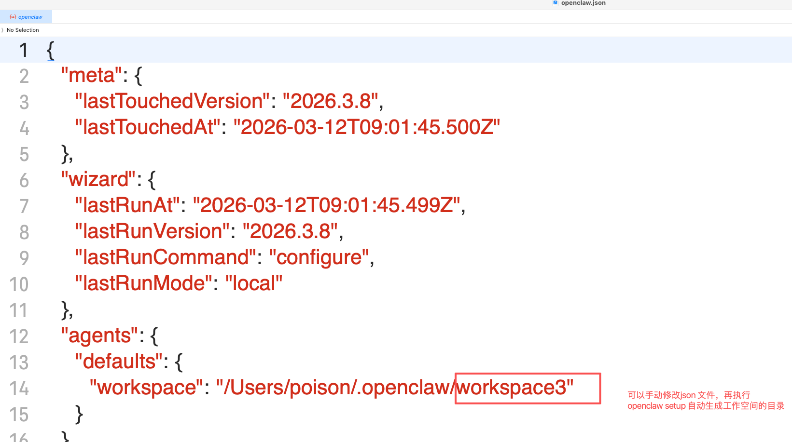


找到子目录里面的.json文件可以配置

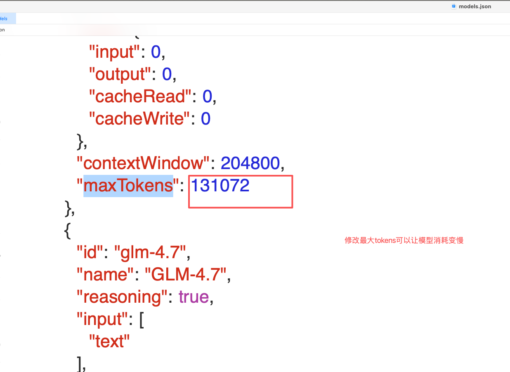

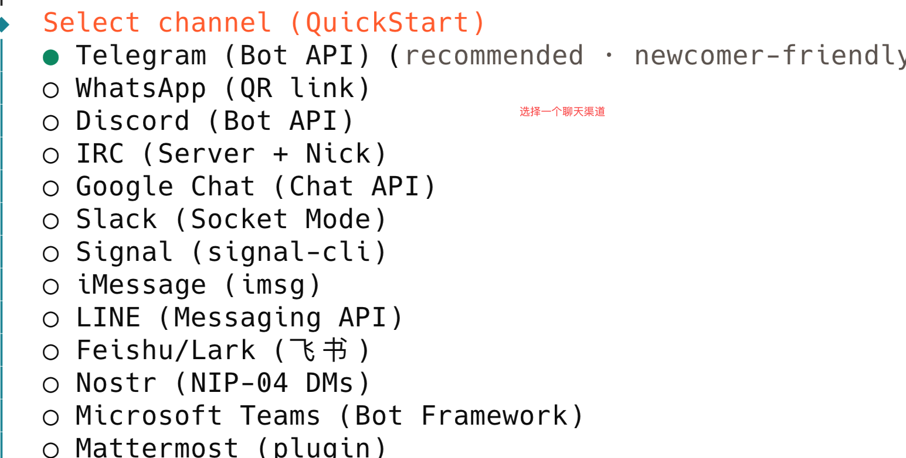


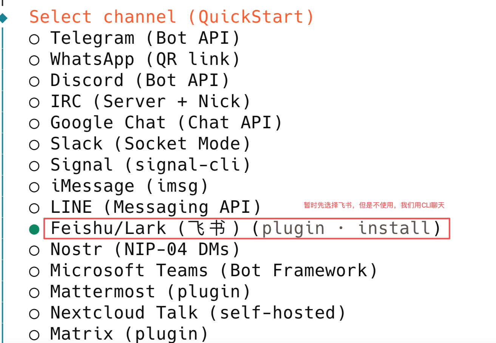


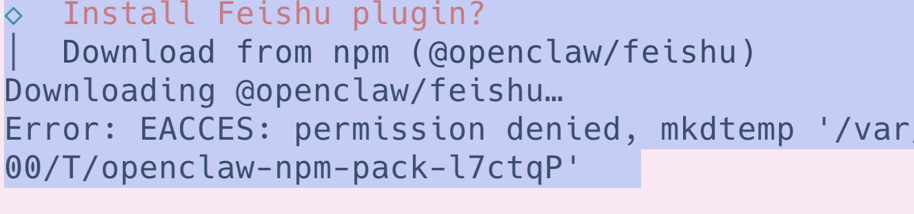


权限错误：

使用sudo重新设置，需要输入开机密码：

```
sudo openclaw configure
```

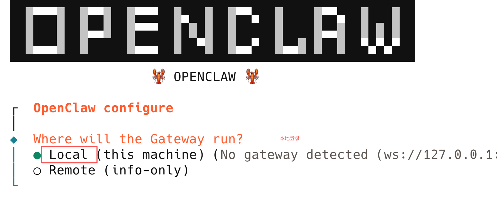

命令行执行：

```
openclaw
```

代表安装成功