# 进入设置页面

```
openclaw config
```

# 选择model

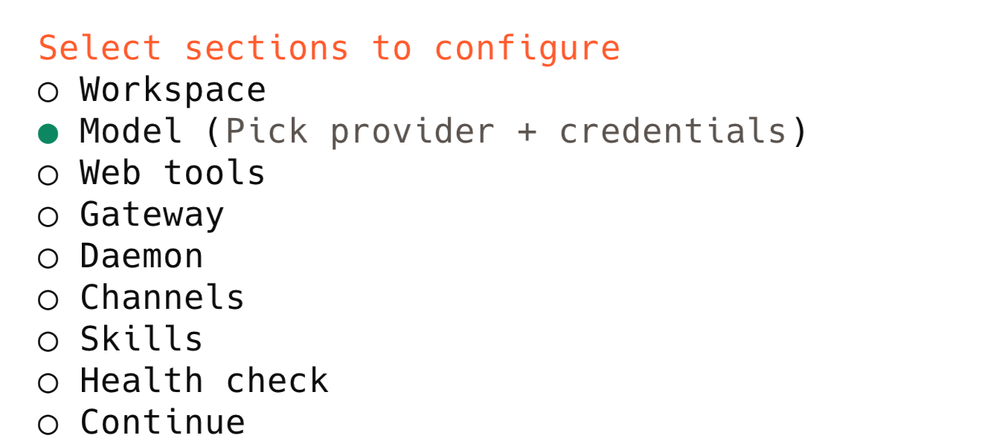

选择智普glm模型


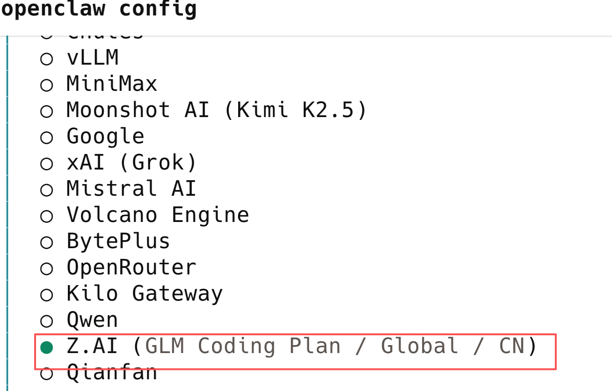

国服：

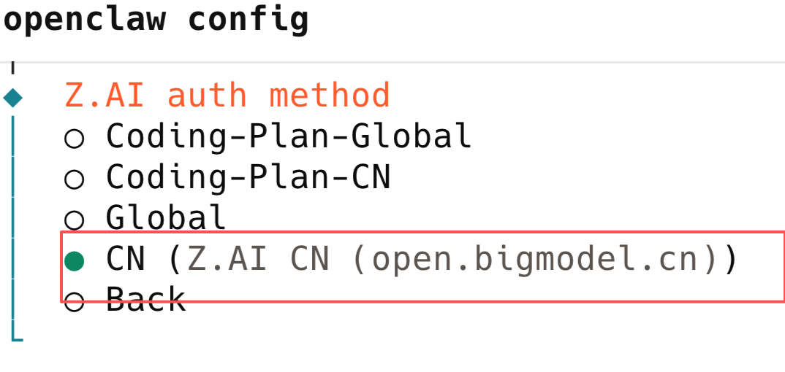

粘贴api key

智普api key页面：

https://bigmodel.cn/usercenter/proj-mgmt/apikeys

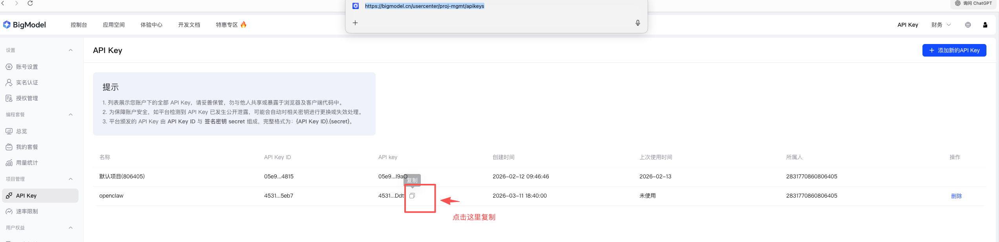

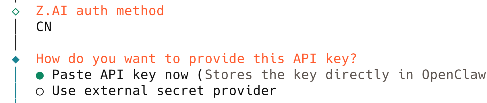

# json中手动设置默认主模型

找到primary ，手写自己的模型 

```
"agents": {

  "defaults": {

   "model": {

​    "primary": "zai/glm-4.5-air",

​    "fallbacks": [

​     "zai/glm-4.7",

​     "zai/glm-4.6v"

​    ]

   },
```


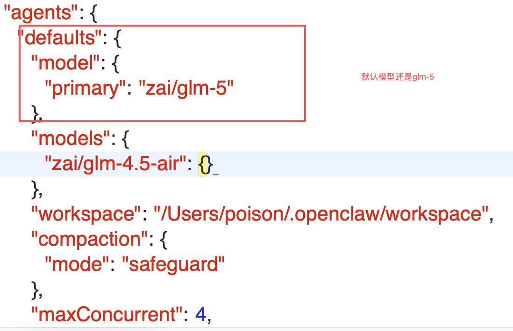

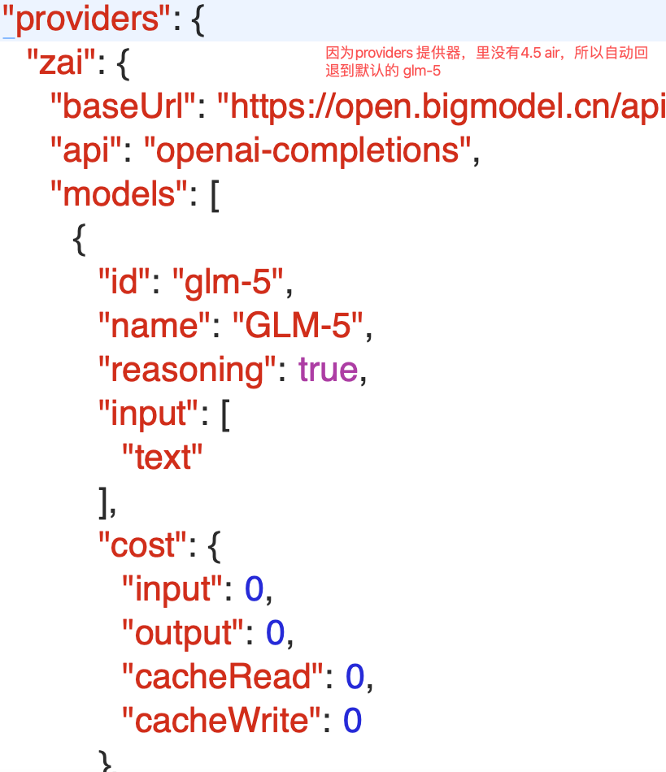


# 自己添加 4.5 air的模型：

```
{
  "id": "glm-4.5-air",
  "name": "GLM-4.5 Air",
  "reasoning": false,
  "input": ["text"],
  "cost": {
    "input": 0,
    "output": 0,
    "cacheRead": 0,
    "cacheWrite": 0
  },
  "contextWindow": 128000,
  "maxTokens": 65536
}
```

# 注意maxTokens 改成小一点，节省很多tokens开销

# contextWindow 上下文窗口

#####  指的是 **模型一次对话能“记住”的最大 token 数量**，简单说就是：**模型一次能看到多少文字的历史内容 + 当前输入 + 生成内容**。

maxTokens 是每次发送的最大

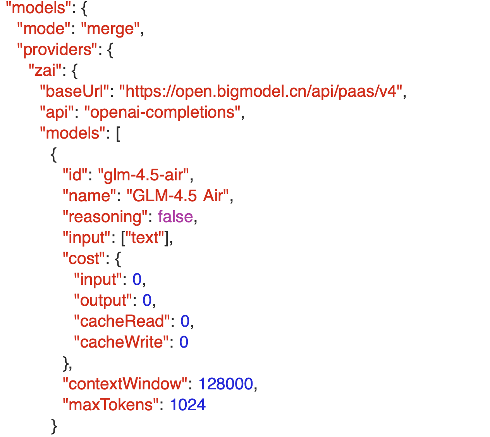

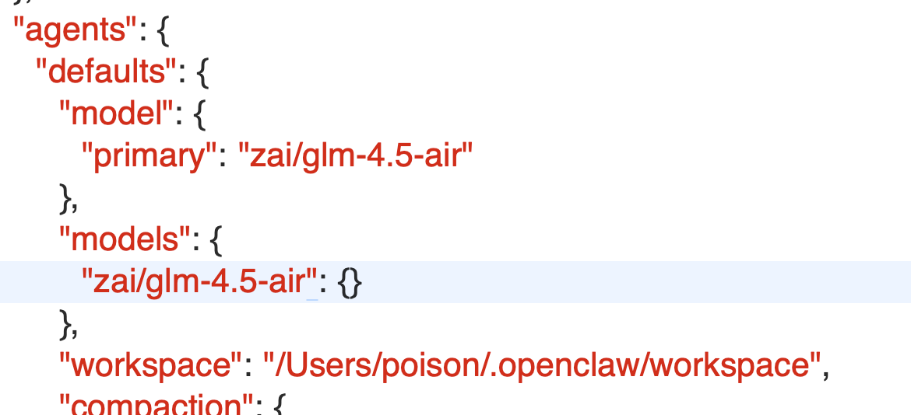


```
openclaw gateway
```

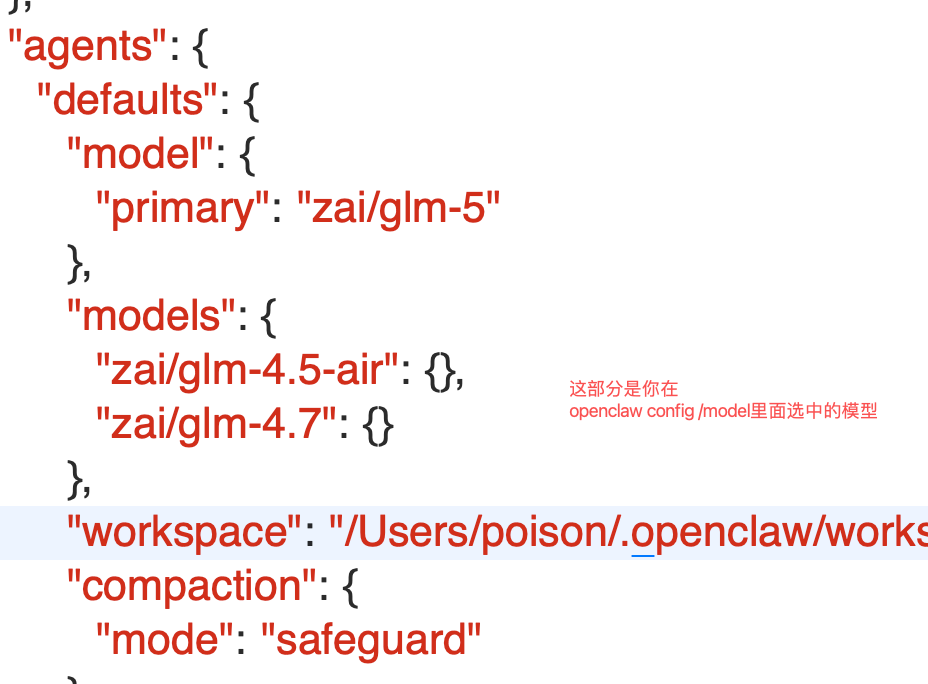


打开：openclaw.json文件

复制最下面的token

```
"gateway": {

  "mode": "local",

  "auth": {

   "mode": "token",

   "token": "2be5516cfc535e3f7460a0fed0bc295359508706e25490d7"

  }
```

2be5516cfc535e3f7460a0fed0bc295359508706e25490d7


先启动网关：

```
openclaw gateway
```

再启动控制面板dashboard

```
openclaw dashboard
```

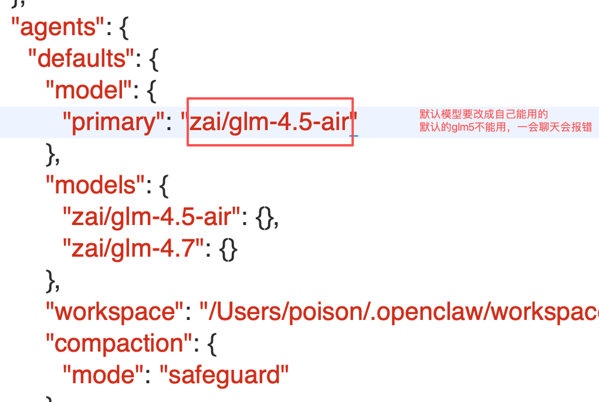


# 查看可用模型：

```
openclaw models list
```


不是用网页，使用命令行tui

先启动网关：

```
openclaw gateway
```

```
openclaw tui
```

