https://open.feishu.cn

# 1.注册飞书开发平台

# 2.创建企业自建应用

https://open.feishu.cn/app?lang=zh-CN


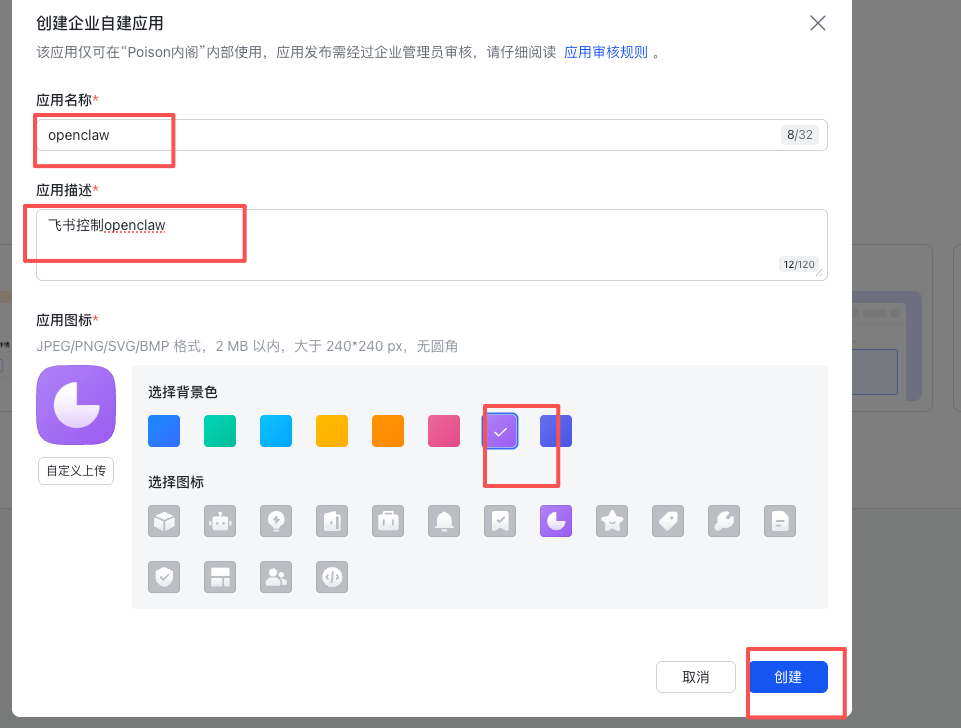


# 3.添加能力：机器人

##### https://open.feishu.cn/app/cli_a93d73e0e338dbca/capability/


# 4.打开openclaw飞书的配置网址：

https://docs.openclaw.ai/zh-CN/channels/feishu

复制里面的json：

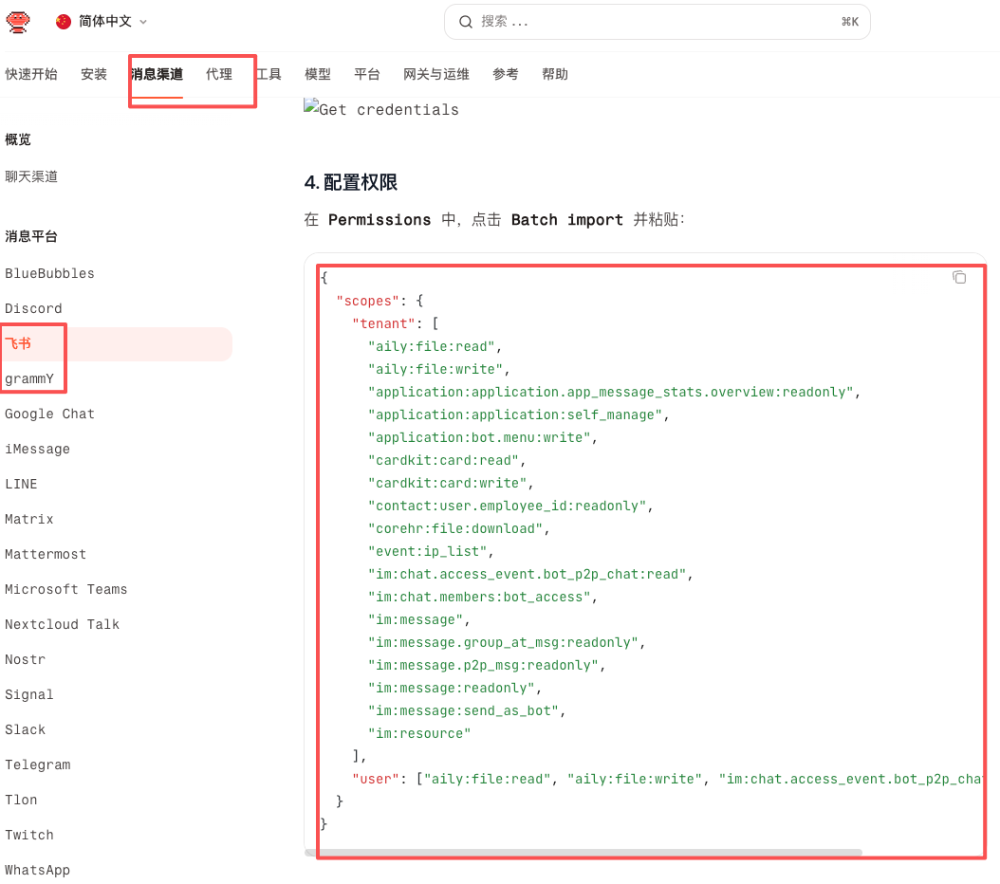


# 5.飞书 权限管理 批量导入/导入权限-粘贴openclaw里面的json，申请开通


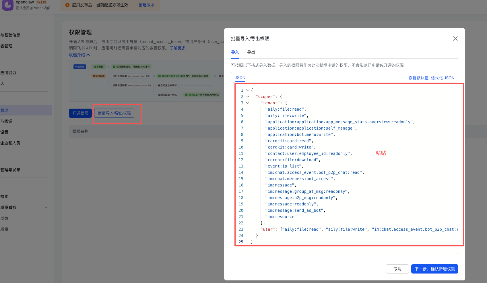

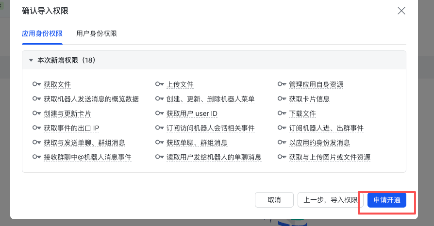

# 4.事件与回调

5.订阅方式->

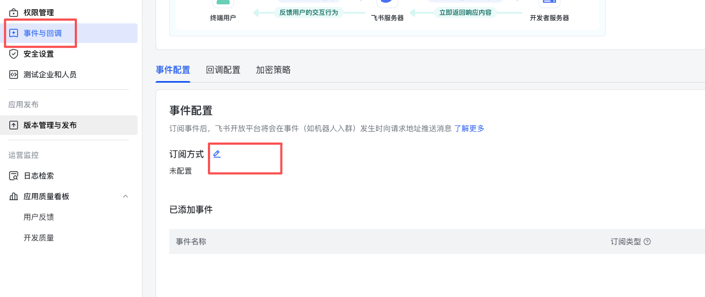

凭证与基础信息->里面复制 app secret 和 app id


# openclaw config里面

找到channel ->飞书

粘贴App Secret

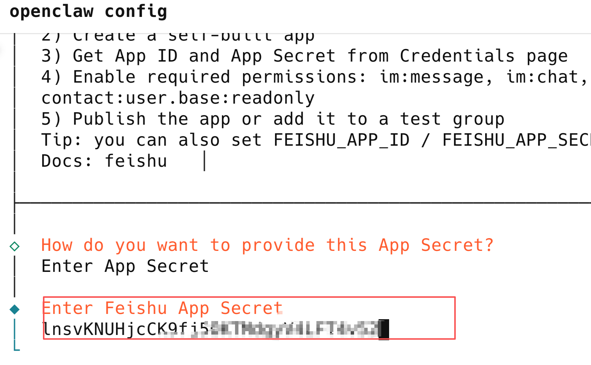


Open claw.json文件里也能配置：

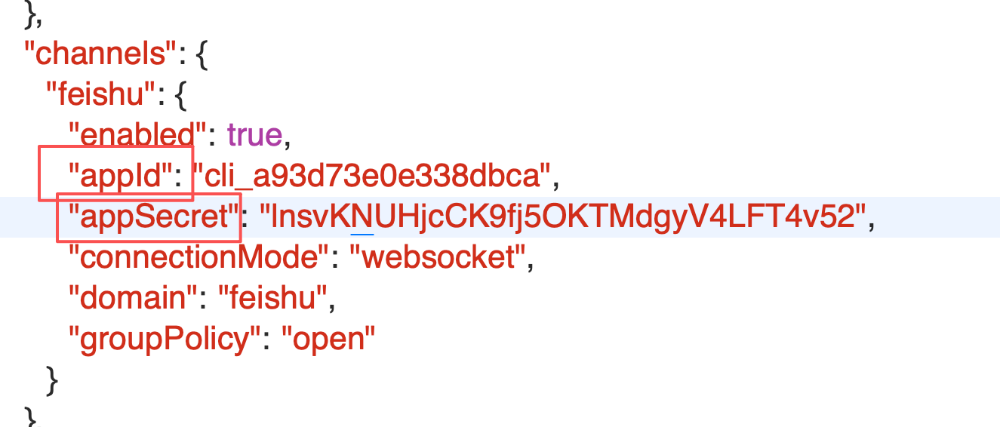

### Allowlist（推荐） 指定群才工作

### Open 所有群都可以用机器人但必须 @机器人

### Disabled

# 这里选open，后面选飞书

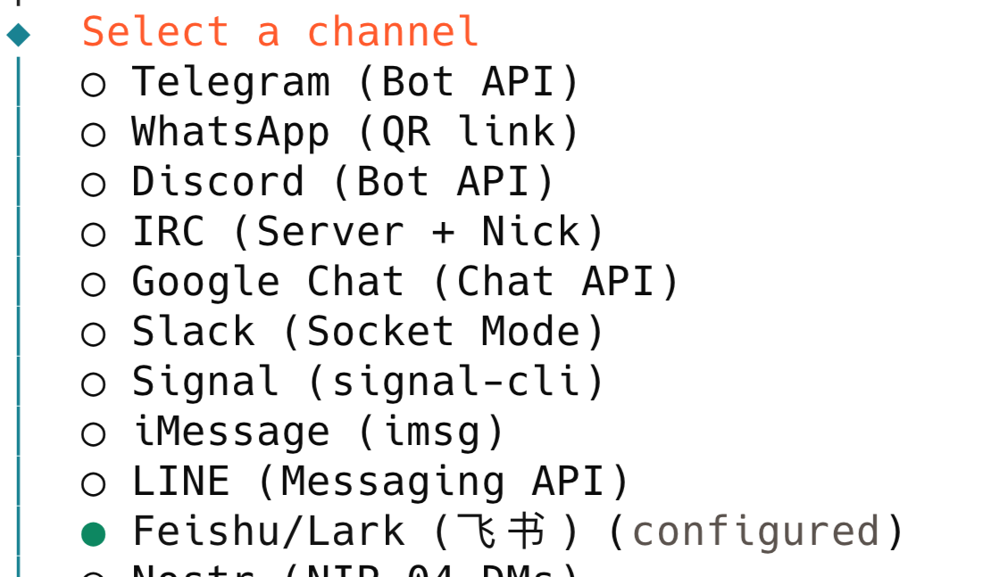

◆  Feishu connection mode
│  ● WebSocket (default)
│  ○ Webhook

◆  Which Feishu domain?
│  ● Feishu (feishu.cn) - China
│  ○ Lark (larksuite.com) - International


输入命令查看是否安装成功，不成功可能是安装文件夹权限问题，查找ai帮你修改权限命令：

# openclaw channels list

查看是否feishu被安装成功


事件与回调 ->订阅方式->长连接 

这里需要先在openclaw config里安装好feishu，并且启动网关openclaw gateway

openclaw gateway启动网关，然后飞书平台 


# openclaw文档中查找 “添加事件”

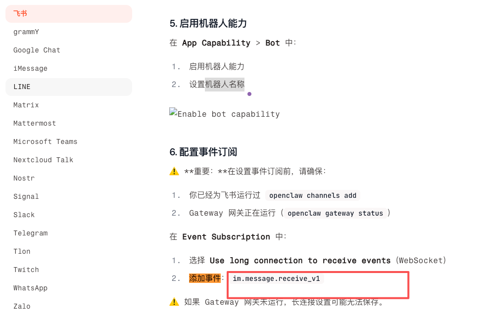

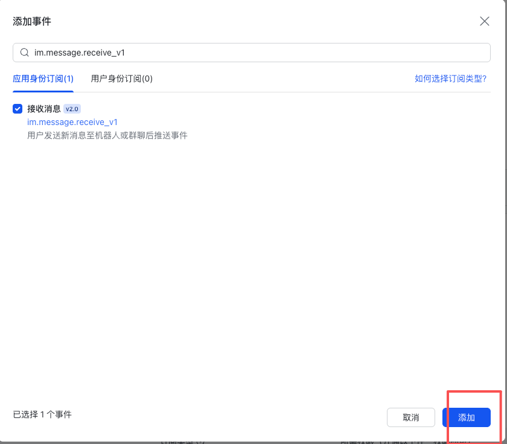


# 创建版本


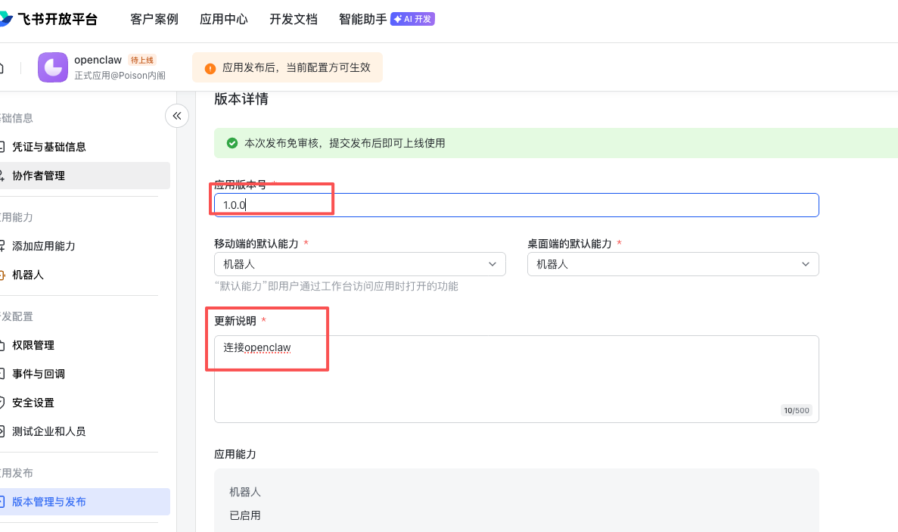


# 设置配对：

在飞书里面输入你好，他会回复一大堆，复制最下面的命令，在电脑端输入配对

```
openclaw pairing approve feishu RSG5H4BN

```

